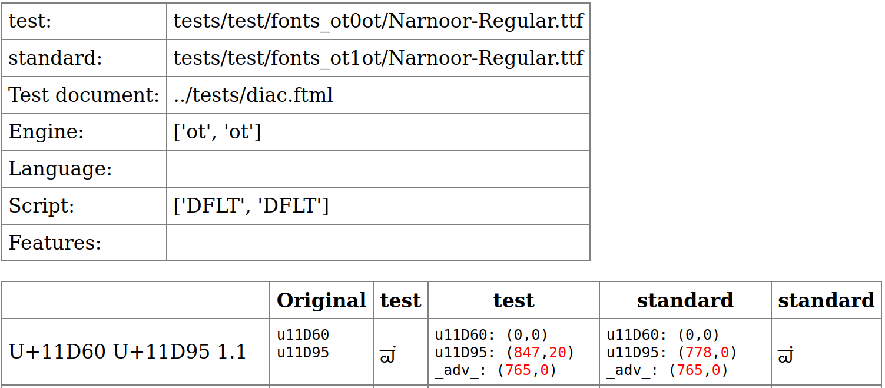
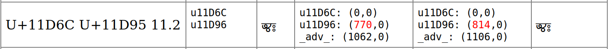
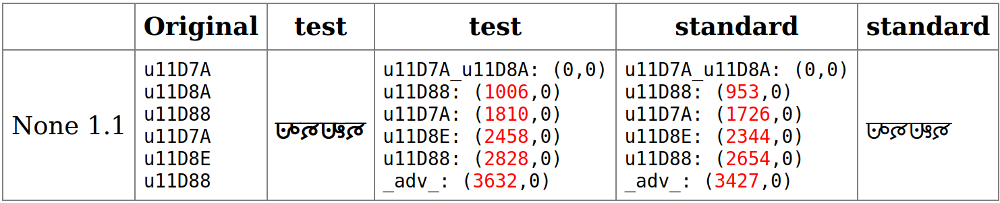
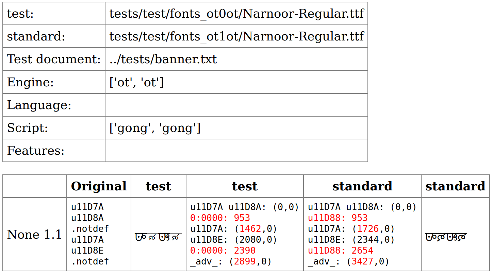

# cmptxtrender

If a large number of files have differences, the author often sorts by size and looks at the smallest report file first. Fixing the issues in the first several files, and then rebuilding the fonts and re-running the tests will hopefully show the remaining issues without being overlooked if the first issues were not fixed first.

Glyph names will be in (parentheses) such as (period)  If the production glyph name and the friendly glyph name differ, both will be written, such as (u11D60/ya).

## A moved anchor

The anchor on the base character (u11D60/avowel) was moved up and to the right. Thus the dot (u11D95/anusvara) has also moved up and to the right. The USV notion (U+) is from the label in the FTML file.

The top of the output shows information about the test that cmptxtrender ran. The TTF filepaths are what cmptxtender uses, those files are copied from folder `results` and `references`. Next the document with samples to test is shown. For regression testing the engine will be the same for both the test and standard, if you are using cmptxtrender to do a cross test (to compare Graphite to OpenType) then the engine listed will not be the same as each other. Script is the OpenType script that cmptxtrender used.

## Width change

The advance width of a character (u11D6C/ya) was changed to be narrower. The second USV does not match the second glyph, this is due to how the FTML file was generated. The 11.2 indicates this is the 2nd word in the 11th test. If the data source was a text file, 11.2 would indicate the 2nd word on the 11th line.

The red color indicates where in the word the change occurred (and therefore where you would want to focus on to understand the change that happened). Since (u11D6C/ya) was made narrower, the next glyph (u11D96/visarga) is moved to the left. The advance width (which is shown by the “glyph” called `_adv_` at the end of the list of glyphs) does change, but since the change did not happen at the end of the word, the advance width is not colored red.

## Drawing a heavier weight

The reference font was still the Regular weight, now a heavier weight has been drawn. The red color highlights numbers that have changed. The first character (u11D7A) is wider, so the next character (u11D88) starts further to the right (1006 vs 953). The numbers for the first character don’t change, since the numbers indicate where the start of the character is positioned, not how wide it is.

The word None indicates that there was not a section (like you would have with a FTML file) since in this case a plain text file was tested.

## Missing character

Here U+11D88 GUNJALA GONDI LETTER RA got un-encoded. The test output then shows 0:0000 since it cannot find a glyph for that codepoint.

